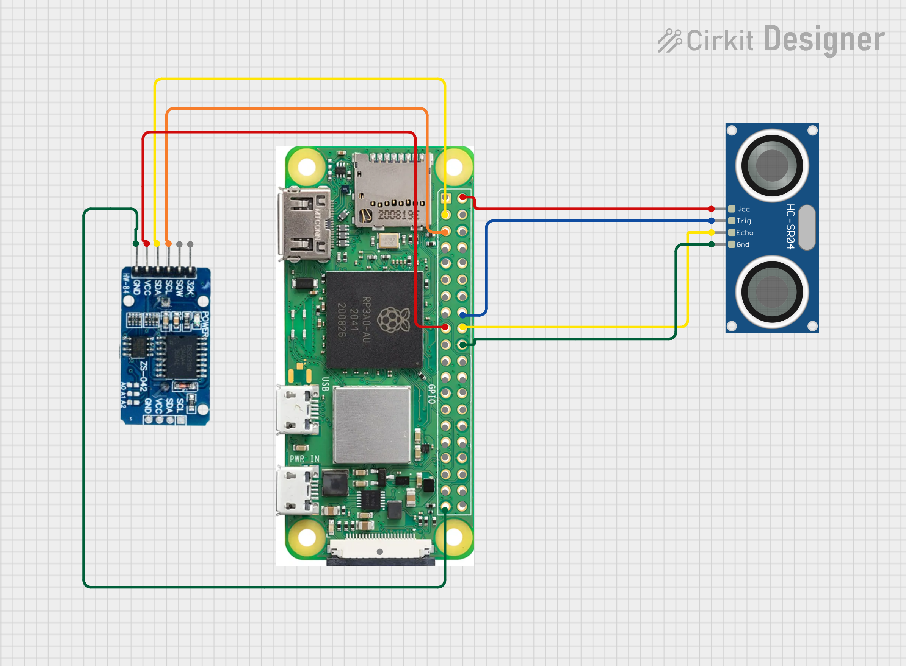

# Water Level Monitoring System
A Raspberry Pi-based water level monitoring system designed for accurate and reliable measurement of water levels in various environments. This system utilizes the following key components:
## Video Demonstration
Check out our video demonstration of the Water Level Monitoring System in action:

[](https://youtube.com/shorts/vs7RvUMaflU)


1. JSN-SR04T Ultrasonic Sensor: A waterproof sensor capable of precise distance measurements, ideal for water level detection.
2. DS3231 Real-Time Clock (RTC) Module: Ensures accurate timekeeping even during power outages or network disconnections.
3. Raspberry Pi Zero 2 W: A compact and powerful single-board computer that serves as the brain of the system.

Key Features:
- Continuous water level monitoring with readings taken every 5 minutes
- Data logging to Google Sheets for easy access and analysis
- Prefect workflow management for reliable and scheduled data collection
- Waterproof design suitable for outdoor installations
- Low power consumption for extended operation
- Real-time clock synchronization for accurate timestamps
- Remote accessibility and monitoring capabilities

This system is perfect for applications such as flood monitoring, reservoir management, irrigation control, and environmental studies. Its modular design allows for easy customization and expansion to meet specific project requirements.

## Hardware Requirements
- Raspberry Pi Zero 2 W (or other models)
- JSN-SR04T Ultrasonic Sensor (Waterproof)
- DS3231 Real-Time Clock module
- Jumper Wires
- Power Supply for Raspberry Pi

## Wiring Guide
## Circuit Diagram


### JSN-SR04T Connections
- VCC → 5V (Pin 2)
- GND → Ground (Pin 6 or Pin 14) 
- TRIG → GPIO 23 (Pin 16)
- ECHO → GPIO 24 (Pin 18)

### DS3231 RTC Connections
- VCC → 3.3V (Pin 1 or Pin 17)
- GND → Ground (Pin 9 or Pin 39)
- SDA → GPIO 2 (Pin 3)
- SCL → GPIO 3 (Pin 5)

## Software Setup

### 1. Install Raspberry Pi OS
Follow the [Headless Raspberry Pi Setup Guide](https://www.raspberrypi.com/documentation/computers/getting-started.html#setting-up-your-raspberry-pi) for detailed instructions on:
- Installing Raspberry Pi OS Lite
- Configuring WiFi and SSH
- First boot and connection

### 2. Configure NTP Servers (Optional)

If you encounter issues with time synchronization, you can use alternative NTP servers:

1. Edit the timesyncd configuration file:
   ```
   sudo nano /etc/systemd/timesyncd.conf
   ```

2. Add the following line under the `[Time]` section:
   ```
   NTP=time.google.com time.cloudflare.com 0.pool.ntp.org 1.pool.ntp.org
   ```

3. Save the file and exit the editor.

4. Restart the timesyncd service:
   ```
   sudo systemctl restart systemd-timesyncd
   ```

### 3. Install Dependencies

1. Update and upgrade your Raspberry Pi:
   ```
   sudo apt update && sudo apt upgrade -y
   ```

2. Install Python development tools:
   ```
   sudo apt-get install python3-venv -y
   ```

3. Create and activate a virtual environment:
   ```
   python3 -m venv base
   source base/bin/activate
   ```

4. Upgrade pip:
   ```
   python -m pip install --upgrade pip
   ```

5. Install the required Python packages:
   ```
   pip install prefect==2.19.9 pyserial==3.5 adafruit-circuitpython-ds3231==2.4.20 RPi.GPIO==0.7.1 oauth2client==4.1.3 gspread==5.10.0 telepot==12.7
   ```

   Note: This project uses Python 3.9.2.

6. Log in to Prefect Cloud (if using):
   ```
   prefect cloud login -k <YOUR_API_KEY>
   ```
   Replace `<YOUR_API_KEY>` with your actual Prefect Cloud API key.

### 4. Google Sheets Setup

To enable logging data to Google Sheets:

1. Google Cloud Project:
   - Go to the [Google Cloud Console](https://console.cloud.google.com/).
   - Create a new project or select an existing one.

2. Enable Google Sheets API:
   - In your project, navigate to "APIs & Services" > "Library".
   - Search for "Google Sheets API" and enable it.

3. Create a Service Account:
   - Go to "APIs & Services" > "Credentials".
   - Click "Create Credentials" and select "Service Account".
   - Follow the prompts to create the service account.
   - Once created, go to the service account details.
   - Under "Keys", add a new key and select JSON format.
   - Download the JSON key file and keep it secure.

4. Set up Prefect Secrets:
   - Create a secret block for your Google Sheets credentials:
     ```
     prefect secret create google-sheets-credentials
     ```
   - When prompted, paste the entire contents of your JSON key file.

   - Create another secret block for your Google Sheets URL:
     ```
     prefect secret create google-sheets-url
     ```
   - When prompted, enter the URL of your Google Sheet.

5. Prepare Your Google Sheet:
   - Create a new Google Sheet or use an existing one.
   - Share the sheet with the email address of your service account (found in the JSON key file).
   - Note the URL of your sheet, you'll need it for the `google-sheets-url` secret.

6. Update the Script:
   - In the `water_level_logger_ultrasonic.py` script, update the `SHEET_NAME` variable if you're using a sheet name other than "Sheet3".

### 5. Test Hardware Components

1. DS3231 RTC Module Test:
   ```
   python rtc_ds3231_init.py
   ```
   This script will initialize and test the RTC module.

2. JSN-SR04T Ultrasonic Sensor Test:
   ```
   python ultrasonic_unit_test.py
   ```
   This script will continuously measure and display distance readings.

### 6. Set up Cron Jobs

1. Open the crontab file for editing:
   ```
   crontab -e
   ```

2. Add the following lines:
   ```
   @reboot sleep 15 && /bin/bash -c 'source /home/pi/base/bin/activate && python /home/pi/water_level_logger_ultrasonic.py' > /home/pi/water_level.log 2>&1
   @reboot sleep 10 && /home/pi/base/bin/python -u /home/pi/water_level_logger_ultrasonic.py > /home/pi/water_level.log 2>&1
   10 0 * * * /home/pi/base/bin/python -u /home/pi/water_level_logger_ultrasonic.py > /home/pi/water_level.log 2>&1
   ```

3. Save and exit the crontab file.

### 7. Final System Test

1. Run the main water level logger script:
   ```
   python water_level_logger_ultrasonic.py
   ```

2. Monitor the output to verify:
   - RTC provides accurate timestamps
   - Ultrasonic sensor takes regular measurements
   - Data is successfully logged to Google Sheets

If everything functions correctly, your water level monitoring system is ready for deployment.

For more information on Prefect, visit the [official Prefect documentation](https://docs.prefect.io/) or check out the [Prefect Quickstart guide](https://docs.prefect.io/latest/getting-started/quickstart/). Also, here is the link of my ChatGPT prompts
https://chatgpt.com/share/162b96fa-579a-4c78-aa06-07bfc86260ab